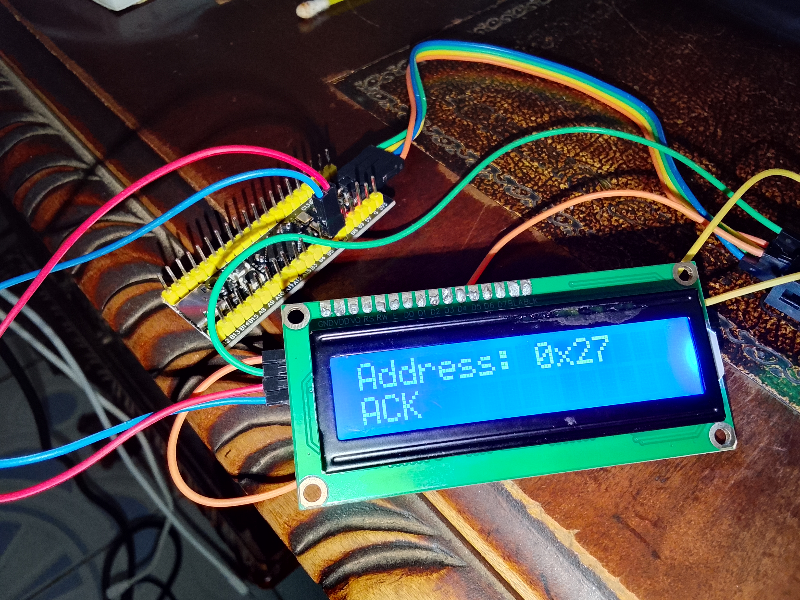

# STM32F401CCU6 I²C ACK/NACK Analyzer

## Project Overview

This project is an **I²C ACK/NACK Analyzer** built using the **STM32F401CCU6** and programmed with **bare-metal/register-level Embedded C**.

The purpose of the project is to deliberately test different I²C addresses and determine whether the device at that address responds with an **ACK (Acknowledgement)** or **NACK (Not Acknowledged)**.

The result is displayed on a **16×2 I²C LCD**.
## Project Code
[Click here to check out the project code](code)

## Project image



## Project Demostration video
[Click here to check out the project Demo Video](https://youtu.be/JCYrYbKyK6w)


The project continuously tests:

```text
0x27
0x42
0x31
0x50
